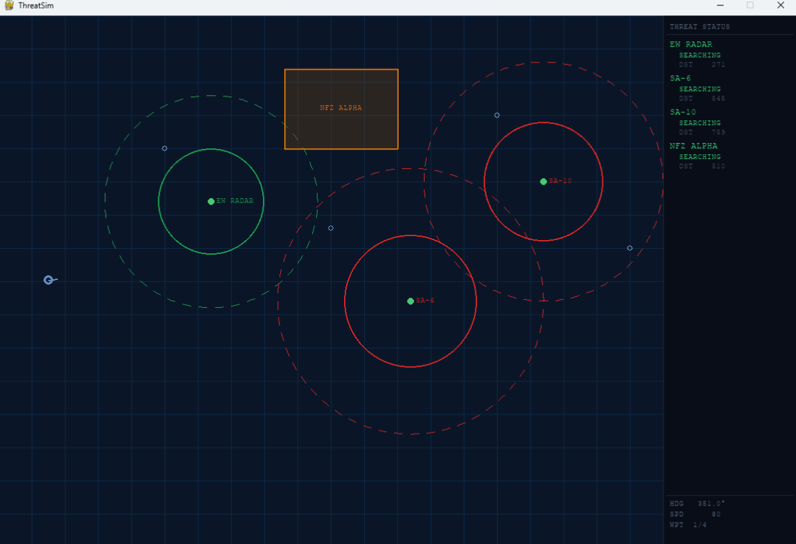

# ThreatSim

A 2D real-time battlefield situational awareness simulator. A friendly aircraft navigates a configurable waypoint route through a threat environment of radar emitters, SAM sites, and no-fly zones. Each threat independently cycles through three detection states as the aircraft moves. Built for studying synthetic threat environment concepts used in defense training systems.

## Install

Requires Python 3.10+.

```bash
pip install -e ".[dev]"
```

For the live pygame display (requires Python ≤ 3.12 due to no pygame wheel for 3.14+):

```bash
pip install -e ".[graphics,dev]"
```

## Run

```bash
python -m threatsim --scenario scenarios/default.json
```

Press **ESC** or close the window to quit.

**Headless mode** (no display — works on any Python version, useful for CI):

```bash
python -m threatsim --scenario scenarios/default.json --headless --steps 500
```

## Screenshot


## Demo



## Threat State Machine

Each threat entity independently cycles through three states based on aircraft proximity:

```
            aircraft enters              aircraft enters
            detection_radius             engagement_radius
                   │                            │
  SEARCHING ──────►│──── TRACKING ─────────────►│──── ENGAGING
      ▲             │        ▲                   │         │
      │             │        └───────────────────┘         │
      │             │         aircraft exits                │
      └─────────────┘         engagement_radius             │
       aircraft exits                                       │
       detection_radius    ◄────────────────────────────────┘
                            aircraft exits engagement_radius
```

| State | Condition | HUD colour |
|---|---|---|
| **SEARCHING** | Aircraft outside detection radius | Green |
| **TRACKING** | Inside detection radius, outside engagement radius | Yellow |
| **ENGAGING** | Inside engagement radius (or no-fly zone polygon) | Red (flashing) |

Transitions are purely distance-based and re-evaluated every simulation tick — state reverts immediately as the aircraft moves away.

**No-fly zones** use polygon geometry instead of radii:
- **TRACKING** — aircraft is within `approach_radius` of any polygon edge
- **ENGAGING** — aircraft is inside the polygon (ray-casting point-in-polygon test)

## Scenario Format

Scenarios are JSON files. See [`scenarios/default.json`](scenarios/default.json) for a complete example.

```json
{
  "window": { "width": 1200, "height": 800 },
  "aircraft": {
    "id": "friendly-1",
    "name": "VIPER 01",
    "start_position": [60, 400],
    "speed": 80,
    "heading": 0,
    "turn_rate": 45,
    "hold_radius": 40,
    "arrival_threshold": 12,
    "waypoints": [[250, 200], [500, 320], [750, 150], [950, 350]]
  },
  "threats": [
    {
      "type": "radar",
      "id": "radar-1",
      "name": "EW RADAR",
      "position": [320, 280],
      "detection_radius": 160,
      "engagement_radius": 80
    },
    {
      "type": "sam",
      "id": "sam-1",
      "name": "SA-6",
      "position": [620, 430],
      "detection_radius": 200,
      "engagement_radius": 100
    },
    {
      "type": "noflyzone",
      "id": "nfz-1",
      "name": "NFZ ALPHA",
      "polygon": [[430, 80], [600, 80], [600, 200], [430, 200]],
      "approach_radius": 40
    }
  ]
}
```

| Field | Description |
|---|---|
| `speed` | World units per second |
| `turn_rate` | Max heading change in degrees per second |
| `hold_radius` | Orbit radius at final waypoint (world units) |
| `detection_radius` | Distance at which TRACKING begins |
| `engagement_radius` | Distance at which ENGAGING begins (must be ≤ detection_radius) |
| `approach_radius` | Distance to polygon boundary at which TRACKING begins (NFZ only) |

## Running Tests

```bash
pytest tests/ -v
```

All 44 tests cover entity logic, threat state transitions, config loading, and headless simulation integration.
